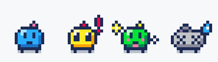

<div align="center">

# Bitling

**A tiny pixel pet that lives in the corner of your screen and reacts to your AI coding agent.**

It thinks while Claude works, waves a big **!** when it needs your approval, sweats when something
breaks, and throws confetti when the job is done. Stop babysitting the terminal.



`idle` · `working` · `waiting for you` · `done` · `error`

[Download](https://github.com/Blazkojj/bitling/releases) · [Quick start](#quick-start) · [How it works](#how-it-works) · [Make it yours](#make-it-yours)

</div>

## Demo

A real Claude Code run: the test fails (Bitling sweats), Claude fixes the bug, the tests pass, and
Bitling levels up and grows a sprout.

<p align="center"></p>

## Why

Coding agents work for minutes at a time, and then quietly wait for you. Bitling turns that into
something you notice from the corner of your eye, without notifications nagging you:

| Bitling... | because your agent... |
| --- | --- |
| 🟦 blinks and sways | is idle |
| 🟦 thinks "..." | is working |
| 🟨 jumps with a bouncing **!** | needs your permission or an answer |
| 🟩 cheers between sparkles | finished the task |
| ⬜ goes pale, X-eyed and sweating | hit an error |

A speech bubble tells you *what* happened ("Bash wants to run `npm test`", "Fixed the login bug").
Every finished task earns XP; your Bitling levels up, grows a sprout at level 5 and a crown at
level 10.

## Features

- 🪟 Tiny transparent window, always on top, drag it anywhere, clicks pass through around it
- 💬 Speech bubbles with the agent's message, 🎵 optional chiptune sounds
- 🎨 Hand-made 10×9 pixel art drawn in code, 4 skins (Classic, Pastel, Midnight, Game Boy)
- ⭐ XP, levels, evolutions and a confetti party on level-up
- 🔌 Works with **Claude Code** (one click, no Node.js needed), **Gemini CLI** and **Codex CLI**
- 👥 Several agent sessions at once: a session waiting for you always wins
- 🧭 Tray icon, remembers its position, launch at login
- 🌐 Simple local HTTP API, so any tool, script or CI job can drive it
- 🪶 Tauri 2 + plain TypeScript, no frontend framework, a few MB, no 60 fps loop

## Quick start

### Download

Grab the installer for Windows, macOS or Linux from
[Releases](https://github.com/Blazkojj/bitling/releases), start Bitling, then **right-click the
pet → Connect Claude Code…** It shows what it will change, backs up your settings and adds the
hooks. Restart Claude Code and give it a task.

### From source

Needs [Node.js](https://nodejs.org) 20.19+, [Rust](https://rustup.rs) and the
[Tauri system dependencies](https://v2.tauri.app/start/prerequisites/).

```bash
git clone https://github.com/Blazkojj/bitling.git
cd bitling
npm install
npm run app            # Bitling appears in the bottom-right corner
```

Then connect your agent, either from the pet's right-click menu (Claude Code) or from a terminal:

```bash
npm run hooks:install                    # Claude Code
npm run hooks:install -- --agent gemini  # Gemini CLI
npm run hooks:install -- --agent codex   # Codex CLI
```

> **No agent at hand?** Right-click → **Play demo**, or `npm run demo`.

## Using Bitling

| Action | What it does |
| --- | --- |
| **Drag** | Move the pet (it remembers where) |
| **Click** | "Seen it": calm the pet down, dismiss the bubble |
| **Hover** | Show level and XP bar |
| **Right-click** / tray icon | Demo, states, skins, sounds, bubbles, launch at login, connect/disconnect Claude Code, quit |
| Keys **1–5**, **D**, **S**, **L** | Idle / done / waiting / error / working, demo, next skin, level-up party (when focused) |

## How it works

```
Claude Code ──HTTP hook──────────────────────────────▶ Bitling (127.0.0.1:47800)
Gemini CLI / Codex ──▶ node ~/.bitling/bitling-hook.mjs ─┘
```

**Claude Code.** "Connect Claude Code…" in the app adds `type: "http"` hooks to
`~/.claude/settings.json` that post straight to Bitling. `npm run hooks:install` does the same
with a small, dependency-free Node script instead. Either way, a timestamped backup is saved and
the other one's hooks are cleaned up.

| Claude Code event | Bitling |
| --- | --- |
| `UserPromptSubmit`, `PostToolUse` | working |
| `Notification` (`permission_prompt`, `elicitation_dialog`) | waiting |
| `PostToolUseFailure`, `StopFailure` | error |
| `Stop` | done (+10 XP, bubble with the first line of Claude's answer) |

**Gemini CLI** hooks `BeforeAgent`, `AfterTool`, `Notification` (`ToolPermission`) and
`AfterAgent` in `~/.gemini/settings.json`. **Codex CLI** gets one `notify` line in
`~/.codex/config.toml` (Codex only reports finished turns).

Hooks never get in the agent's way: they return in ~0.1 s, never print to stdout (except the `{}`
Gemini expects), always exit 0 and give up after 1.5 s when Bitling isn't running.

Remove everything with right-click → **Disconnect Claude Code**, or
`npm run hooks:uninstall [-- --agent gemini|codex]`.

## HTTP API

Bitling listens on `127.0.0.1` only, so anything can make it react: a long build, a deploy, your
test watcher.

```bash
curl -X POST http://127.0.0.1:47800/event \
  -H "Content-Type: application/json" \
  -d '{"state": "done", "source": "ci", "message": "Deploy finished 🚀"}'
```

| Route | Description |
| --- | --- |
| `POST /event` | `{"state": "idle" \| "working" \| "done" \| "waiting" \| "error", "source"?, "message"?, "session"?}`, or a raw Claude Code hook payload |
| `GET /state` | Current state, XP and active sessions |
| `GET /health` | `{"ok": true, "app": "bitling", "version": "..."}` |
| `POST /show` | Bring the window back |

`POST` requires `Content-Type: application/json`, which websites can't send cross-origin, so no web
page can poke your pet. Events with `"source": "demo"` don't earn XP.

## Make it yours

The sprites are plain text in [`src/sprites.ts`](src/sprites.ts): one character per pixel, a
palette per state, and a list of frames with timings. Skins live in [`src/skins.ts`](src/skins.ts),
evolutions in `ACCESSORIES`. Edit, save, and `npm run dev` reloads in the browser
(`http://localhost:1420/?demo`, or `?state=waiting&skin=gameboy&level=12&say=Hi`).

```
......A...
.....E....
..HHBBBB..
.BHEBBEBB.
.BBEBBEBD.
.BBBBBBBD.
.BBBEEBBD.
..DDDDDD..
..L....L..
```

`npm run sprites -- --gif` re-exports the preview (Node 22.18+). New skins, moods and evolutions
are the best kind of PR.

## Settings and files

Everything lives in `~/.bitling/`: `state.json` (XP, stats), `config.json` (skin, sound, bubbles,
position) and the hook script.

| Environment variable | Default | |
| --- | --- | --- |
| `BITLING_PORT` | `47800` | Port of the local API (set it for the app *and* the hooks) |
| `BITLING_HOME` | `~/.bitling` | Data directory |
| `BITLING_DEMO` | unset | `1` starts in demo mode |

## Roadmap

- [x] Transparent always-on-top pet with animated states, speech bubbles, sounds
- [x] Claude Code: one-click connect from the app, Node installer as an alternative
- [x] Gemini CLI and Codex CLI adapters
- [x] XP, levels, evolutions, level-up party, skins
- [x] Multiple sessions, tray, remembered position, launch at login, single instance
- [x] Prebuilt installers via GitHub Actions
- [ ] More agents (Cursor, Aider, OpenCode...) and editor extensions
- [ ] More moods (sleepy at night, bored when idle for long), more evolutions
- [ ] Signed and notarized builds, auto-update
- [ ] Bitling friends: one pet per project

## Troubleshooting

- **Black box around the pet (Linux).** Transparent windows need a compositing window manager
  (GNOME, KDE and most modern desktops have one).
- **Nothing happens when Claude works.** Restart Claude Code after connecting, check `/hooks`, and
  test the pipe with `npm run demo` or the curl above.
- **"Port 47800 unavailable".** Another app uses the port: set `BITLING_PORT` for both the app and
  the hooks.
- **macOS says the app is from an unidentified developer.** Builds aren't notarized yet:
  right-click the app → Open.

## Contributing

Issues and PRs are welcome, especially sprites, skins, agent adapters and platform fixes.

```bash
npm run dev      # frontend only, in the browser
npm run app      # full desktop app
npm test         # JS + Rust tests
```

## License

[MIT](LICENSE)
